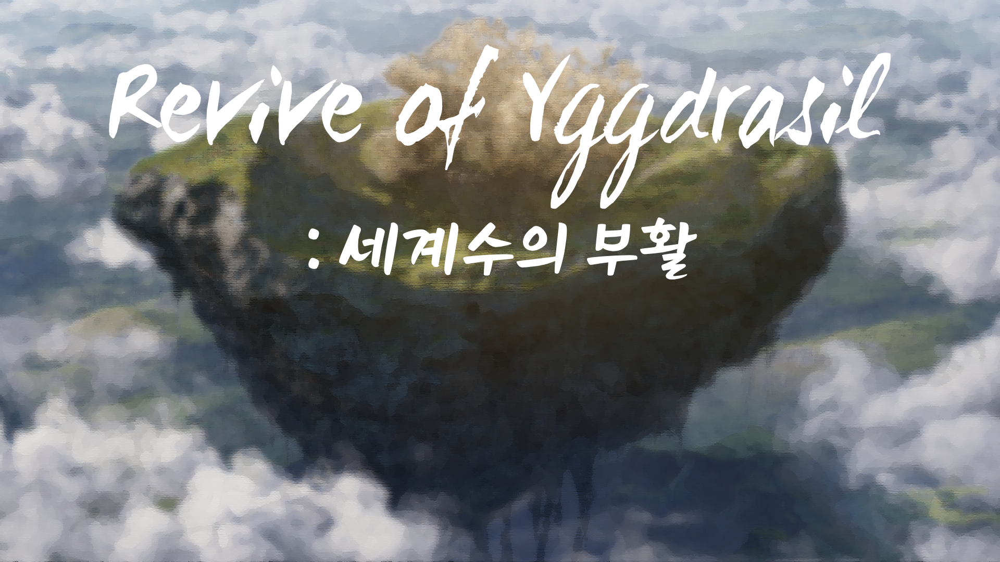
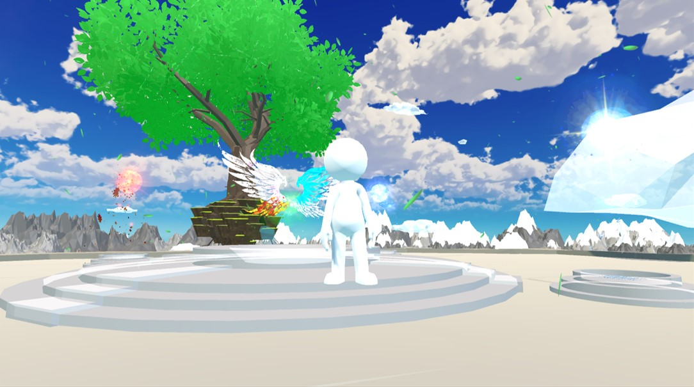

# Yggdrasil.github.io

# 게임 타이틀
## Revive of Yggdrasil:세계수의 부활

# [소개]

## 대표 이미지

### 장르

- 3D 어드벤처 퍼즐게임

### 스토리

- 세계의 중심에는 세계수가 자리하고 있었다. 세계수는 세상의 균형을 유지하고 있었다. 
세계수에게는 세상의 균형을 유지할 수 있는 힘이 담겨있었으며, 그렇기에 이런 힘을 탐내는 이들 또한 존재하였다. 
이 힘을 탐낸 이들은 결국 세계수를 공격하여 힘을 빼앗으려 하였다. 
이들은 세계수에게 큰 피해를 입혔으나, 힘은 빼앗지 못하고 세계수의 힘으로 인해 소멸하였다. 
악한 자들을 공격한 것의 반동으로 인해 세계수의 힘이 4개로 나뉘어져 흩어져 버렸다. 
그로인해 세상의 균형을 유지할 수 없는 세계수는 시들고 세상에는 어둠이 다가오고 있었다. 
세계수의 요정은 이 사태를 수습하기 위해 자신의 대부분의 힘을 짜내어 세계수 주변에서 벗어날 수 없는 자신을 대신하여 대행자 역할을 하여 4개의 힘을 되찾아올 요정을 하나 만들었다. 
그렇게 4계의 정수를 찾아 세계수를 되살리기 위한 모험이 시작된다. 

  

# [게임 흐름도 & 플레이 매커니즘]

### 흐름도
  
  
### 플레이 매커니즘
  플레이어는 게임 시작 시 세계수 맵에서 스폰하게 된다. 만약 플레이어가 정수를 가지고 있지 않다면 정령NPC를 통해 봄, 여름, 가을, 겨울 맵 중 한가지를 선택해 이동할 수 있다. 
  맵을 이동 후에는 맵에 있는 기믹들을 해결하고 끝에서 핵심 아이템(정수)를 획득 할 수 있다. 
  정수를 획득하게 되면 세계수의 맵으로 돌아오게 된다. 
  정수를 제단에 바치면 세계수의 모습이 변한다. 
  핵심아이템을 다 모았다면 세계수는 원래 모습을 되찾고 엔딩 크래딧으로 이동하여 게임이 종료된다. 그렇지 않다면 클리어 하지 않은 맵으로 이동하여 전과 동일하게 기믹을 해결하여 핵심 아이템을 수집한다. 

  

# [대표 이미지]

  

# [컨셉 & 대표이미지 기반 작품묘사]

> ### 대표이미지 기반 :

> ### 컨셉 기반:

  

# [<게임제목> 구성 요소]

- 가나다라마바사아차카타파하 가나다라마바사아차카타파하

 

## 1. 메커니즘

[도전 과제]

1. 가나다라마바사아차카타파하
2. 가나다라마바사아차카타파하

[재미 요소]

1. 가나다라마바사아차카타파하
2. 가나다라마바사아차카타파하

 

## 2. 이야기

[만들게 된 배경]  
가나다라마바사아차카타파하 가나다라마바사아차카타파하

[카메라 관점]  
가나다라마바사아차카타파하 가나다라마바사아차카타파하

 

## 3. 미적요소

[디자인][컬러]  
가나다라마바사아차카타파하 가나다라마바사아차카타파하

[음향]  
가나다라마바사아차카타파하 가나다라마바사아차카타파하
 

## 4. 기술

가나다라마바사아차카타파하 가나다라마바사아차카타파하
