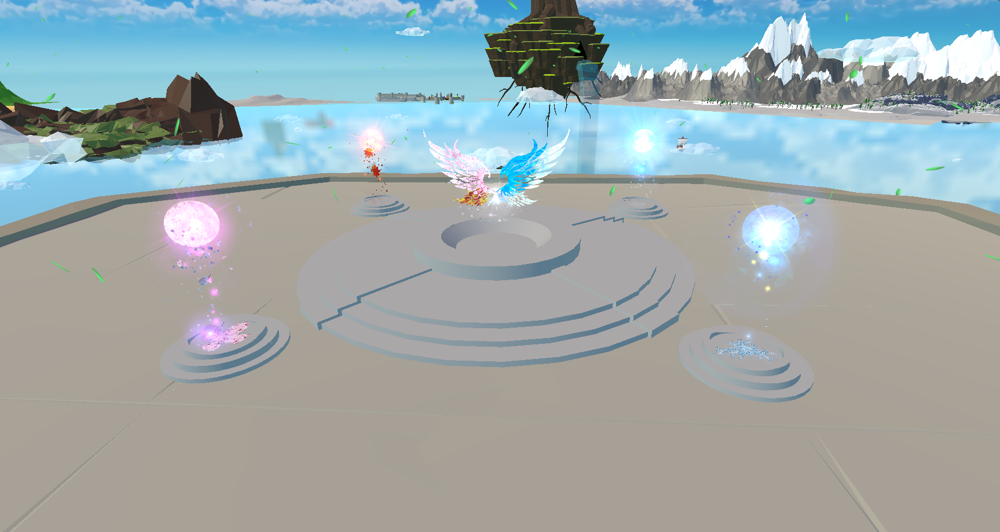

# Yggdrasil.github.io

# 게임 타이틀
## Revive of Yggdrasil:세계수의 부활

# 목차
### 1. 소개 (#1)
### 2. 게임 흐름도 & 플레이 매커니즘 (#2)
### 3. 엔딩 조건 (#3)
### 4. 맵 & 기믹 소개 (#4)
### 5. 팀 소개 (#5)

# 소개 

## 대표 이미지

### 장르

- 3D 어드벤처 퍼즐게임

### 스토리

- 세계수가 공격을 받아 세계수의 기운이 4개로 분리되어 흩어진다. 세계수 요정의 대행자가 세계수를 살리기 위해 사계절의 땅을 여행하며, 여러 존재들을 도와 사계의 정수를 수집해 힘을 잃은 세계수를 되살리는 스토리

  

# 게임 흐름도 & 플레이 매커니즘 

### 흐름도
  
  
### 플레이 매커니즘
  플레이어는 게임 시작 시 세계수 맵에서 스폰하게 된다. 만약 플레이어가 정수를 가지고 있지 않다면 정령NPC를 통해 봄, 여름, 가을, 겨울 맵 중 한가지를 선택해 이동할 수 있다. 
  맵을 이동 후에는 맵에 있는 기믹들을 해결하고 끝에서 핵심 아이템(정수)를 획득 할 수 있다. 
  정수를 획득하게 되면 세계수의 맵으로 돌아오게 된다. 
  정수를 제단에 바치면 세계수의 모습이 변한다. 
  핵심아이템을 다 모았다면 세계수는 원래 모습을 되찾고 엔딩 크래딧으로 이동하여 게임이 종료된다. 그렇지 않다면 클리어 하지 않은 맵으로 이동하여 전과 동일하게 기믹을 해결하여 핵심 아이템을 수집한다. 

  

# 엔딩 조건

- 사계의 정수를 모두 모아 제단에 바쳐야 한다.

  

# 맵 & 기믹 소개

## 세계수
- 정수를 바칠때마다 세계수의 모습에 변화가 생긴다.

### 초기 모습
- 전체적으로 맵이 어두우며 세계수가 힘을 잃은 모습

### 봄의 정수 수집
- 세계수의 잎이 돋아난 모습

### 여름의 정수 수집
- 세계수의 폭포가 생겨난 모습

### 가을의 정수 수집
- 맵의 비가 그친 모습

### 겨울의 정수 수집
- 맵의 하늘이 밝아진 모습

### 모두 수집
- 세계수가 완전히 회복한 모습

## 봄
### 맵
- 봄의 정원

### 돌 옮기기
- 발판의 숫자에 맞춰 돌 옮기기

### 참새 둥지 만들기
- 나뭇가지, 깃털, 알을 모아 둥지 복원

### 미로 쥐
- 토마토를 이용해 쥐를 유인하여 버튼 누르기

### 폭탄꽃으로 폭탄 제작
- 폭탄꽃을 기계에 넣어 폭탄 제작

### 바위 파괴 & 벌 옮기기
- 폭탄으로 바위 제거 후 벌이 좋아하는 꽃을 가지고 꽃가루 옮기기

### 밸브 고치기
- 스프링클러를 작동하기 위해 맵에 숨겨진 손잡이를 찾아 밸브 고치기

### 고라니 & 거름
- 고라니의 공격을 유도해 나무의 열매를 구해 거름 제작

### 꽃 피우기
- 꽃가루, 물, 거름을 모아 꽃을 피워 봄의 정수 획득

## 여름
### 맵
- 난파된 배들이 있는 섬

### 무덤 만들기
- 유골을 모아서 무덤 제작

### 미로 탈출
- 미로를 탈출해 열쇠 구하기

### 보물방 열기
- 열쇠로 보물방 문 열기

## 가을
### 맵
- 가을 농장

### 문 열기
- 점프 패드를 옮겨 높은 곳에 있는 열쇠 구하기

### 스위치 퍼즐
- 버튼을 모두 눌린 버튼으로 변경

### 여우 몰이
- 밭에 숨어있는 여우를 여우집으로 몰이

### 곰 퇴치
- 맵에 숨겨져 있는 돌들을 찾아 곰에게 던져 퇴치

## 겨울
### 맵
- 눈사람 마을

### 얼음벽 녹이기
- 장작불로 얼음벽 녹이기

### 레이저 퍼즐
- 레이저의 경로를 바꿔 지정된 곳에 닿게 하기

### 눈사람 찾기
- 돌아가는 미로에 숨어있는 눈사람 찾기

### 꼬마 눈사람 데려오기
- 맵에 있는 꼬마 눈사람을 큰 눈사람에게 데려가기

  

# 팀 소개

## 팀명
전나신박

## 구성원
전민성
나정원
신중훈
박종현

## 제작담당
### 맵
<b>세계수</b> : 박종현 
<b>봄</b> : 박종현 
<b>여름</b> : 나정원 
<b>가을</b> : 전민성 
<b>겨울</b> : 신중훈
### UI
전민성
### NPC
신중훈
### 파티클
나정원

## 제작기간
15주

## 추진일정
| 활동 내용 | 2024.3  | 2024.4 | 2024.5 | 2024.6 |
|:----:|:----:|:----:|:----:|:----:|
| 기획 | 🡺 | | | |
| 플레이어 캐릭터 | 🡺 | 🡺 | | |
| 프로그래밍 | 🡺 | 🡺 | 🡺 | 🡺 |
| 레벨 디자인 | | 🡺 | 🡺 | 🡺 |
| UI & 파티클 & 사운드 | | | 🡺 | 🡺 |
| NPC | | | 🡺 | 🡺 |
| 디버깅 | | | | 🡺 |
